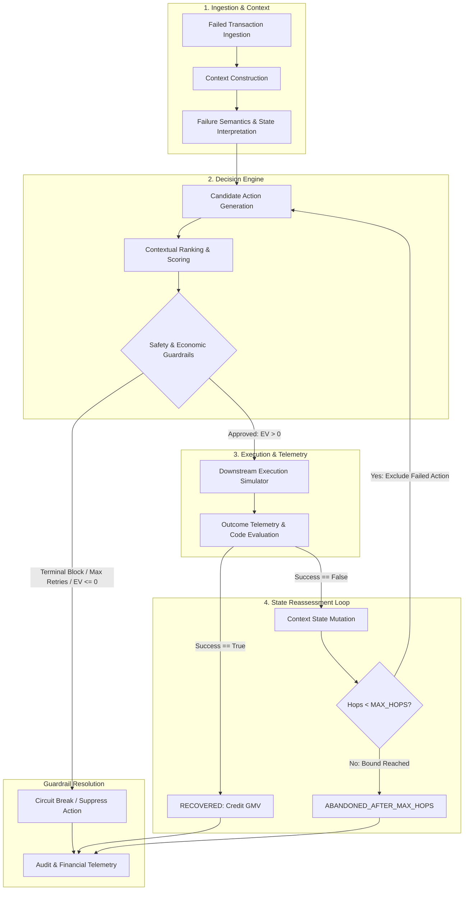
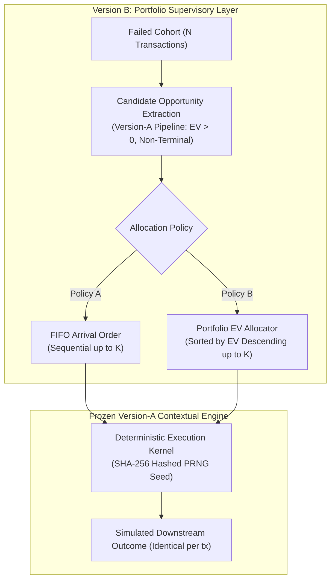

# System Architecture & Technical Specification

> **Contextual Intent & Cross-Rail Autonomous Payment Recovery Engine**  
> *Technical Walkthrough Document & Evaluation Reference*

---

## 1. System Objective

In high-throughput payment systems, failed digital transactions represent immediate **Gross Merchandise Value (GMV) leakage**. Traditional recovery mechanisms address failures through **naive blind retries**—re-submitting identical payment payloads over the exact same rail without inspecting failure semantics, rail health, or customer presence.

Blind retries introduce three fundamental engineering and economic vulnerabilities:
1. **Financial Penalty Losses**: Retrying liquidity failures (`INSUFFICIENT_FUNDS`) or dead Core Banking Systems (CBS) triggers bank bounce penalties (typically ₹250+ per NACH/debit bounce).
2. **Customer Channel Degradation**: Re-prompting authentication modals or blasting repetitive OTPs to abandoned sessions drives permanent cart abandonment and friction.
3. **Negative Expected-Value Recovery**: Operational fees (gateway routing charges and communication template costs) on micro-transactions frequently exceed the merchant's gross margin.

### The Autonomous Contextual Objective
The objective of this recovery engine is **not maximum retry volume**, but **economically bounded, context-aware recovery**. The system evaluates real-time transaction signals, payment rail health, and customer session posture to determine whether a recovery attempt is viable, select the optimal cross-rail action, enforce strict stopping rules, and log a verifiable audit trail.

---

## 2. End-to-End Architecture

The following diagram illustrates the closed-loop autonomous lifecycle. Downstream execution telemetry feeds directly back into context mutation and state reassessment:

---

## 3. Recovery Lifecycle

The engine implements a formal 10-stage execution pipeline within `AutonomousRecoveryPipeline` in `agent.py`:

1. **Failure Ingestion**: Ingests the initial failed transaction object (`amount`, `currency`, `error_code`, `failure_category`, `initial_retry_count`).
2. **Context Construction**: Assembles the ambient operational environment:
   - Rail and gateway health (`secondary_pg_health`, `bank_cbs_health`).
   - Customer capabilities (`customer_upi_intent_supported`, `customer_has_saved_mandate`, `customer_preferred_rail`).
   - Customer posture (`session_active`, `intent_score`, `time_since_failure_sec`).
3. **Failure Semantics Interpretation**: Normalizes error codes into semantic failure categories:
   - `INFRASTRUCTURE_FAILURE` (e.g., `GATEWAY_TIMEOUT`, `HTTP 504`)
   - `BANK_DOWNTIME` (e.g., `BANK_CBS_DOWN`, `ISSUER_UNAVAILABLE`)
   - `USER_FRICTION` (e.g., `AUTHENTICATION_FAILED`, `OTP_EXPIRED`)
   - `LIQUIDITY_LIMIT` (e.g., `INSUFFICIENT_FUNDS`)
   - `TERMINAL_FAILURE` (e.g., `CARD_BLOCKED_OR_STOLEN`, `FRAUD_SUSPECTED`)
4. **Candidate Recovery Generation**: Generates viable, unattempted recovery strategies based on the current state.
5. **Contextual Ranking**: Computes a dynamic confidence score ($P \in [0.0, 1.0]$) for each candidate using environmental health and customer rail affinity.
6. **Guardrail Evaluation**: Evaluates policy rules (terminal failure check, max-retry threshold) and computes Expected Value ($EV$).
7. **Downstream Execution**: Dispatches the approved action to the simulated payment network.
8. **Outcome Telemetry**: Observes the resulting status code and validates recovery success.
9. **State Reassessment**: If execution fails, mutates context (degrading the failed rail, decaying intent, setting `session_active = False`) and advances the hop counter.
10. **Stopping & Audit Logging**: Terminates cleanly when recovered, suppressed, or when $MAX\_HOPS$ is reached, writing comprehensive traces to `audit_trail.json` and `deep_audit_trail.json`.

---

## 4. Decision Engine

### Implementation Truth: Heuristic Logic, Not Machine Learning
The decision layer is implemented as **deterministic arithmetic and heuristic ranking logic**. It does **NOT** use a trained deep-learning model, gradient booster, or Large Language Model (LLM). This is an explicit architectural choice:
- **Reproducibility**: Guarantees deterministic behavior for testing, verification, and regression auditing.
- **Auditability**: Every ranking score and guardrail decision can be mathematically decomposed into explicit contextual terms.
- **Sub-millisecond Latency**: Evaluates candidates synchronously without external API overhead.

### Candidate Actions
The engine supports four core recovery strategies:
* `SWITCH_SECONDARY_PG`: Transparently reroutes card transactions to an alternate, healthy payment gateway during primary gateway timeouts.
* `TRIGGER_CROSS_RAIL_UPI`: Pops an in-checkout UPI Intent modal when the issuing bank's card CBS is offline but the customer session is active.
* `SCHEDULE_MANDATE_BATCH`: Queues auto-debit processing for non-urgent subscription payments or when the customer is outside the checkout window.
* `DISPATCH_ASYNC_RECOVERY_LINK`: Sends a pre-filled WhatsApp/SMS payment recovery link when the customer has abandoned checkout.

### Confidence Scoring Formulation
Candidates are scored based on contextual alignment:
* `SWITCH_SECONDARY_PG`: $P = \text{secondary\_pg\_health} \times 0.95 \times (\text{affinity\_boost} \text{ if preferred else } 1.0)$.
* `TRIGGER_CROSS_RAIL_UPI`: $P = 0.85 \times (\text{affinity\_boost} \text{ if preferred else } 1.0) \times (\text{decay factor if latency > 30s})$.
* `SCHEDULE_MANDATE_BATCH`: $P = 0.70 \times (0.90 \text{ if liquidity failure else } 1.0)$.
* `DISPATCH_ASYNC_RECOVERY_LINK`: $P = \text{intent\_score} \times 0.45 \times (\text{time decay})$.

---

## 5. Execution Simulator

### Separation of Concerns: Decision vs Execution
Selecting a recovery candidate **does not guarantee settlement**. The recovery engine maintains a decoupled downstream simulator (`execute_downstream_action`) representing payment rails, issuer banks, and consumer behavior.

* **Downstream Grounding**: Execution success is determined probabilistically from environmental context:
  - Secondary PG routing success depends jointly on `secondary_pg_health` and `bank_cbs_health`.
  - UPI Intent success is grounded in user session presence and intent score.
  - Mandate execution simulates bank core processing windows.
  - Recovery links model asynchronous user opening and payment conversion rates.
* **Failure Feedback**: Downstream declines (e.g., `SECONDARY_PG_504_GATEWAY_TIMEOUT`, `OTP_TIMEOUT_NO_ENTRY`) return distinct telemetry codes that drive state mutation in the decision loop.

---

## 6. Guardrails & Stopping Rules

The engine enforces four layers of policy and economic protection:

### 1. Terminal Failure Circuit Breaker
- Errors classified as `TERMINAL_FAILURE` (e.g., stolen cards, frozen accounts, severe fraud alerts) are rejected immediately (`SUPPRESSED_TERMINAL_FAILURE`).
- **Policy**: 0 attempts permitted. Protects merchants from network compliance flags and chargeback liabilities.

### 2. Policy Maximum-Retry Boundary
- If a transaction arrives with `initial_retry_count >= 3`, the circuit breaker halts execution immediately (`CIRCUIT_BROKEN_MAX_RETRIES`).

### 3. Economic Expected Value (EV) Guardrail
Before any recovery attempt is dispatched, the engine computes its net financial expectation:
$$\text{Expected Value (EV)} = (\text{Amount} \times P_{\text{confidence}}) - \text{Attempt\_Cost} - ((1 - P_{\text{confidence}}) \times \text{Downstream\_Penalty\_Risk})$$

- **Parameters**:
  - Routing attempt cost: ₹15.00
  - WhatsApp notification template cost: ₹3.00
  - Bank bounce penalty risk: ₹250.00 (applied to un-gated liquidity retries)
- **Rule**: If $\text{EV} \le 0$, the action is suppressed (`SUPPRESSED_NEGATIVE_EV`). This protects merchant margins on low-ticket transactions where recovery costs exceed statistical yield.

### 4. Bounded Multi-Hop Limits & Action Exclusion
- `MAX_HOPS = 2`: An individual transaction is bounded to a maximum of 2 sequential recovery attempts.
- **Action Exclusion**: Any strategy attempted in Hop 1 is appended to `excluded_actions` and cannot be re-selected in Hop 2.

---

## 7. Benchmark Methodology

### Shared Controlled Batch Comparison
To scientifically measure recovery efficacy without bias, the test suite evaluates **both the Naive Baseline and the Contextual Engine on the exact same 50-transaction synthetic dataset** using the identical simulation kernel.

* **Naive Baseline Model**: Simulates standard industry blind retries:
  - Re-attempts the primary rail up to 2 times.
  - No cross-rail capability; ignores gateway health and bank CBS status.
  - Incurs ₹15.00 per attempt and ₹250.00 bank penalty when retrying offline CBS or empty accounts.
* **Contextual Recovery Model**: Executes the full 10-stage autonomous lifecycle with cross-rail discovery, state reassessment, and EV guardrails.

> **Controlled Simulation Notice:** This benchmark is an offline simulation executed on a synthetic, scenario-driven test dataset. It validates recovery mechanics, guardrails, and decision logic under controlled conditions; it is not a claim of real-world or live production Razorpay performance.

---

## 8. Benchmark Metrics & Performance

| Performance Metric | Baseline (Naive Engine) | Contextual Recovery Engine | Delta / Operational Impact |
| :--- | :---: | :---: | :--- |
| **Total Transactions Evaluated** | 50 | 50 | Identical shared batch |
| **Gross Revenue at Risk** | INR 189,661.00 | INR 189,661.00 | Full cohort GMV evaluated |
| **Gross Revenue Recovered** | INR 9,495.00 | **INR 130,224.00** | **+13.7x revenue captured** |
| **Recovery Success Rate (%)** | 5.01% | **68.66%** | High conversion via alternate rails |
| **Total Recovery Attempts** | 99 | **43** | **56.6% fewer network attempts** |
| **Successful Recoveries** | 5 | **34** | Confirmed simulated settlements |
| **Failed Executions** | 94 | **9** | Drastically reduced failure rate |
| **Recovery Efficiency** | 5.1% | **79.1%** | 4 out of 5 attempts recover funds |
| **Simulated Bank Bounce Penalties** | INR 11,500.00 | **INR 0.00 (Protected)** | Protected from dead CBS / empty accounts |
| **Net Financial Recovery** | **INR -3,490.00 (Loss)** | **INR 129,579.00** | Net recovery after fees and penalties |
| **Protective Circuit Breaks** | 0 (Blind loop) | **10 Protected** | Terminal blocks & negative EV stops |

---

## 9. Curated Lifecycle Traces

### Trace A: Contextual Divergence on Identical Failure (`GATEWAY_TIMEOUT`)
* **Scenario A1 (`txn_fail_1001` | INR 1,499.00 | CARDS)**:
  - Context: Session Active (`HOT`), Secondary PG Health: 93%, Latency: 7s.
  - Decision: `SWITCH_SECONDARY_PG` (Confidence: 0.96 | EV: INR 1,424.04).
  - Outcome: Transparent gateway switch succeeds (`SECONDARY_PG_200_OK`) $\rightarrow$ **`RECOVERED`**.
* **Scenario A2 (`txn_fail_1002` | INR 8,500.00 | CARDS)**:
  - Context: Session Abandoned (`WARM`), Secondary PG Health: 47% (Degraded), Latency: 71s.
  - Decision: Engine detects degraded secondary PG and avoids it; pivots to `DISPATCH_ASYNC_RECOVERY_LINK`.
  - Outcome: Dispatches asynchronous recovery link $\rightarrow$ **`RECOVERED`**.

### Trace B: Downstream Failure $\rightarrow$ State Reassessment $\rightarrow$ Bounded Fallback
* **Transaction `txn_fail_1007` (INR 4,999.00 | Authentication Drop)**:
  - **Hop 1**: In-session user prompted with frictionless auth link. User closes modal (`OTP_TIMEOUT_NO_ENTRY`).
  - **State Reassessment**: Context mutates dynamically: `session_active = False`, intent decays $0.85 \rightarrow 0.51$, time elapsed increases.
  - **Hop 2**: Interactive auth is excluded. Engine pivots to asynchronous recovery link (`DISPATCH_ASYNC_RECOVERY_LINK`).
  - Customer does not convert within link expiry window $\rightarrow$ Engine terminates cleanly at **`ABANDONED_AFTER_MAX_HOPS`** (bounded at 2 hops, zero infinite loop).

### Trace C: Guardrail Protections (Terminal Security & Economic EV)
* **Terminal Security Block (`txn_fail_1008` | INR 15,000.00)**:
  - Error: `CARD_BLOCKED_OR_STOLEN`.
  - Guardrail: Circuit breaker activates; blocks automated recovery attempts for terminal security failures.
  - Status: `SUPPRESSED_TERMINAL_FAILURE` (0 attempts, zero liability).
* **Economic EV Suppression (`txn_fail_1034` | INR 49.00)**:
  - Error: `GATEWAY_TIMEOUT` on low-ticket order (INR 49.00) with cold session intent (0.31).
  - Guardrail: Mathematical evaluation yields $EV = \text{INR } -12.61 \le 0$.
  - Status: `SUPPRESSED_NEGATIVE_EV` (0 attempts, suppressed because estimated expected value is non-positive).

---

## 10. Auditability & Telemetry Storage

Every decision, state mutation, and downstream outcome is logged to persistent JSON artifacts in `data/`:
* `data/audit_trail.json`: Summary audit trail recording initial error, final resolution status, total attempts, recovered GMV, and hop-by-hop execution history with rationale.
* `data/deep_audit_trail.json`: Detailed machine-readable telemetry recording exact confidence scores, computed expected values, simulated response codes, and contextual transition states.

---

## 11. Prototype Boundaries & Operational Scope

To maintain technical accuracy, the prototype operates within the following boundaries:
* **Synthetic Testbed**: Benchmark datasets are synthetically generated scenarios designed to test failure edge cases.
* **Simulated Environment**: Gateway health and bank CBS availability are contextual snapshots rather than live banking webhooks.
* **Deterministic Scoring**: Decision logic uses explicit arithmetic heuristics rather than black-box neural networks.
* **In-Memory Simulation**: Payment execution is modeled locally; no real bank accounts or payment gateways are debited.
* **Not Production Infrastructure**: This project is an algorithmic proof-of-concept and technical demonstration.

---

## 12. Version B: Portfolio Recovery Allocator (Supervisory Experimental Layer)

While **Version A** operates autonomously at the single-transaction lifecycle level (evaluating and reassessing recovery on a per-transaction basis), production merchants frequently operate under **macro capacity constraints**:
- Daily outbound communication limits (WhatsApp Business API / SMS gateway quotas).
- Bank API rate limits and gateway connection concurrency limits.
- Customer contact fatigue thresholds.

Under finite attempt capacity $K$, an unprioritized arrival-order execution may consume quota on low-margin or low-confidence transactions while starving high-value, high-confidence recovery opportunities.

---

### 12.1 Architectural Hierarchy

Version B introduces a **supervisory allocation layer** sitting strictly above the frozen Version-A transaction recovery engine:

- **Zero Pipeline Modification**: The underlying `AutonomousRecoveryPipeline` and its decision rules are completely frozen and untouched.
- **Shared Opportunity Set**: Both policies evaluate the exact same set of viable candidates extracted by Version-A guardrails.
- **Order-Independent Simulation**: Downstream outcomes are isolated via a cryptographic hash-seeded execution kernel (`SHA-256(base_seed : tx_id : action : hop)`), ensuring transaction outcome invariance regardless of execution order.

---

### 12.2 Mathematical Formulation

The portfolio recovery problem under attempt capacity $K$ is formulated as a bounded 0-1 knapsack / priority optimization problem:

$$\max \sum_{i=1}^N x_i \cdot \text{EV}_i$$

$$\text{subject to} \quad \sum_{i=1}^N x_i \le K, \quad x_i \in \{0, 1\}$$

where:
$$\text{EV}_i = (\text{Amount}_i \cdot P_i) - C_{\text{attempt}}$$
and:
- $x_i = 1$ indicates recovery attempt dispatched for opportunity $i$.
- $P_i \in [0, 1]$ is the contextual confidence score generated by Version A.
- $C_{\text{attempt}} = \text{INR } 15.00$ is the operational cost per recovery attempt.
- Eligible set is pre-filtered by Version-A guardrails: $\text{is\_terminal}_i = \text{False}$ and $\text{EV}_i > 0$.

---

### 12.3 Controlled Experimental Methodology

To scientifically isolate the impact of the allocation policy from transaction-level intelligence, the experiment enforces strict experimental controls:

1. **Identical Opportunity Set**: Both policies receive the exact same 40 eligible opportunities extracted from the canonical 50-transaction cohort (6 terminal security failures and 4 negative-EV candidates excluded).
2. **Order-Independent Determinism**: Downstream simulated gateway responses are decoupled from execution sequence using SHA-256 derived seeds. Transaction $T_{1001}$ yields the identical success/failure code whether processed 1st (FIFO) or 15th (Portfolio).
3. **Finite Attempt Capacity ($K$)**: Both policies are evaluated under identical capacity quotas $K \in \{10, 20, 30, 43\}$.
4. **Falsifiable Empirical Assessment**: Performance outcomes are recorded and reported truthfully without forced assertions.

---

### 12.4 Empirical Benchmark Results

Running `python run_portfolio_experiment.py` on the shared 50-transaction synthetic benchmark produces the following measured results:

#### Primary Experiment ($K = 20$ Capacity Limit)

| Performance Metric | Policy A (FIFO Arrival Order) | Policy B (Portfolio EV Allocator) | Measured Delta |
| :--- | :--- | :--- | :--- |
| **Allocation Policy** | Natural Arrival Order | Highest EV First | -- |
| **Attempt Capacity ($K$)** | 20 | 20 | 0 |
| **Attempts Dispatched** | 20 | 20 | 0 |
| **Successful Recoveries** | 14 | 17 | +3 |
| **Failed Executions** | 6 | 3 | -3 |
| **Starved Opportunities** | 20 | 20 | 0 |
| **Recovered Gross GMV** | **INR 50,139.00** | **INR 100,489.00** | **+INR 50,350.00 (+100.4%)** |
| **Operational Costs** | INR 300.00 | INR 300.00 | INR 0.00 |
| **Net Financial Recovery** | **INR 49,839.00** | **INR 100,189.00** | **+INR 50,350.00 (+101.0%)** |
| **Recovery Efficiency** | 70.0% | 85.0% | +15.0% |

> **Notice**: *Measured result -- not a guaranteed improvement. Synthetic simulation experiment.*

#### Capacity Sensitivity Analysis ($K \in \{10, 20, 30, 43\}$)

| Attempt Capacity ($K$) | Policy A (FIFO GMV) | Policy B (Portfolio GMV) | Delta GMV | Percentage Gain | Regime Dynamics |
| :--- | :--- | :--- | :--- | :--- | :--- |
| **$K = 10$ (Extreme Scarcity)** | INR 15,793.00 | INR 85,497.00 | +INR 69,704.00 | **+441.4%** | Extreme capital preservation; top high-ticket recoveries captured. |
| **$K = 20$ (Primary Scarcity)** | INR 50,139.00 | INR 100,489.00 | +INR 50,350.00 | **+100.4%** | Substantial alpha over unprioritized arrival order. |
| **$K = 30$ (Moderate Capacity)** | INR 76,933.00 | INR 103,485.00 | +INR 26,552.00 | **+34.5%** | Marginal returns taper as high-EV opportunities are exhausted. |
| **$K = 43$ (Unconstrained Capacity)** | INR 105,528.00 | INR 105,528.00 | +INR 0.00 | **0.0%** | Full opportunity set executed ($40 \le 43$); policies converge. |

---

### 12.5 Diagnostic Boundary Comparison: $K = 43$ vs Version-A Canonical Benchmark

At $K = 43$, attempt capacity exceeds the eligible opportunity count (40 opportunities). Both policies execute the entire opportunity set and converge to **INR 105,528.00**.

Comparing this result against Version-A's canonical benchmark reveals an architectural scope distinction:
- **Version-A Canonical Benchmark**: **INR 130,224.00** recovered across 43 attempts.
- **Version-B Boundary ($K = 43$)**: **INR 105,528.00** recovered across 40 attempts.
- **Numerical Difference**: **-INR 24,696.00**.

#### Scope Explanation
- **Version A** models a **dynamic multi-hop state machine**: transactions that fail in Hop 1 undergo state mutation and can attempt a secondary recovery path (Hop 2, e.g., interactive auth failure falling back to async WhatsApp link).
- **Version B** models **finite single-hop cohort opportunity allocation**: it extracts the primary viable opportunity per transaction and evaluates capacity allocation across the cohort.
- The difference (+INR 24,696.00 in Version A) represents the revenue recovered via dynamic multi-hop reassessment (Hop 2 recoveries).
- Both results are methodologically valid within their declared scopes, confirming that Version B evaluates allocation policy rather than rewriting the multi-hop lifecycle.
