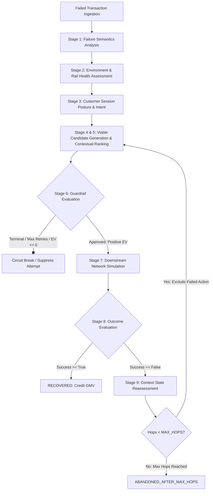

# Contextual Intent & Cross-Rail Autonomous Payment Recovery Engine

> **Prototype Submission:** Autonomous payment failure recovery engine combining root-cause semantics, multi-rail orchestration, customer session posture, and dynamic economic guardrails.
> 
> **Architecture & Technical Walkthrough:** See [ARCHITECTURE.md](file:///c:/Users/pavan/payment-recovery-engine/ARCHITECTURE.md) for full state diagrams, mathematical formulas, and lifecycle specifications.

---

## 1. Problem Statement & Context

When digital payment transactions fail, merchants face significant **Gross Merchandise Value (GMV) leakage**. Traditional payment systems typically address failed transactions using **naive blind retries**:
* Automatically re-attempting the exact same payment rail with an identical payload.
* Retrying without awareness of whether the issuing bank's Core Banking System (CBS) is down.
* Blindly retrying liquidity failures (`INSUFFICIENT_FUNDS`), incurring recurring bank bounce penalties (NACH/debit penalties).
* Treating abandoned sessions, network timeouts, and stolen cards identically.

This approach creates severe downstream costs:
1. **Financial Penalty Losses**: Failed retries against empty accounts or offline CBS trigger bank bounce fees (typically ₹250+ per bounce).
2. **Customer Friction & Drop-off**: Spammed OTP prompts and broken checkout flows drive cart abandonment.
3. **Negative ROI on Retries**: Operational network fees and channel messaging costs on low-ticket items exceed the order's gross margin.

---

## 2. The Contextual Recovery Approach

This engine replaces blind retries with **Context-Aware, Multi-Rail Autonomous Recovery**:
* **Semantic Root-Cause Categorization**: Distinguishes transient infrastructure timeouts, issuing bank CBS outages, user authentication friction, liquidity limits, and terminal security flags.
* **Payment Environment & Rail Discovery**: Evaluates real-time health across secondary payment gateways, alternate rails (UPI Intent, Netbanking, Cards), and saved recurring autopay mandates.
* **Customer Session Posture**: Analyzes whether the customer is active in the checkout modal (`HOT_IN_CHECKOUT`), recently exited (`WARM_RECENTLY_ABANDONED`), or cold dropped (`COLD_DROPPED`).
* **Dynamic Economic Expected Value (EV) Guardrail**: Mathematically models whether a recovery attempt is financially justified:
  $$\text{Expected Value (EV)} = (\text{Amount} \times P_{\text{confidence}}) - \text{Attempt\_Cost} - ((1 - P_{\text{confidence}}) \times \text{Downstream\_Penalty\_Risk})$$
  Attempts with $\text{EV} \le 0$ are suppressed to protect merchant margins.
* **Bounded Multi-Hop State Reassessment**: If a recovery action fails, the engine updates context (marking the failed rail degraded and the session inactive) and dynamically re-evaluates remaining viable strategies, bounded to a maximum of 2 hops.

---

## 3. High-Level Architecture & Recovery Lifecycle



### 10-Stage Lifecycle Execution
1. **Failure Semantics**: Classifies failure into infrastructure, bank downtime, liquidity, friction, or terminal decline.
2. **Environment Assessment**: Checks health of secondary card PG, bank CBS status, and available rails.
3. **Customer Posture**: Evaluates real-time checkout presence and intent score decay.
4. **Candidate Generation**: Identifies viable, non-attempted recovery actions.
5. **Contextual Ranking**: Scores candidate confidence based on environmental health, customer preferred rail, and latency.
6. **Policy & Economic Guardrails**: Evaluates terminal fraud flags, 3-attempt hard bounds, and net Expected Value (EV).
7. **Downstream Simulation**: Simulates downstream network execution based on contextual probability distributions (selecting an action $\neq$ recovery).
8. **Outcome Evaluation**: Validates response codes; credits revenue only on confirmed success.
9. **State Reassessment**: On failure, mutates session state to inactive, decays intent score, degrades failed rail health, and updates time elapsed.
10. **Bounded Termination**: Enforces strict `MAX_HOPS = 2` to eliminate infinite loops.

---

## 4. Controlled Simulation Benchmark: Baseline vs Contextual Engine

Both engines evaluate the **identical 50-transaction synthetic dataset** using the **same downstream simulation kernel**:
* **Baseline Engine (Naive Blind Retry)**: Up to 2 retries on the primary rail with ₹15 attempt cost and ₹250 penalty on dead rails / empty accounts.
* **Contextual Recovery Engine**: 10-stage autonomous lifecycle with cross-rail routing and EV guardrails.

### Benchmark Telemetry Results

| Performance Metric | Baseline (Naive Engine) | Contextual Recovery Engine | Operational Impact |
| :--- | :---: | :---: | :--- |
| **Total Transactions Evaluated** | 50 | 50 | Shared controlled test batch |
| **Gross Revenue at Risk** | ₹189,661.00 | ₹189,661.00 | Total evaluated transaction volume |
| **Gross Revenue Recovered** | ₹9,495.00 | **₹130,224.00** | **+13.7x simulated revenue captured** |
| **Recovery Success Rate (%)** | 5.01% | **68.66%** | High conversion via alternate rails |
| **Total Recovery Attempts** | 99 | **43** | **56% fewer network attempts** |
| **Successful Recoveries** | 5 | **34** | Confirmed simulated settlements |
| **Failed Executions** | 94 | **9** | Drastically reduced failure rate |
| **Recovery Efficiency** | 5.1% | **79.1%** | 4 out of 5 attempts recover funds |
| **Simulated Bank Bounce Penalties** | ₹11,500.00 | **₹0.00 (Protected)** | Protected from dead CBS / empty accounts |
| **Net Financial Recovery** | **-₹3,490.00 (Net Loss)** | **+₹129,579.00** | Gross recovered minus costs and penalties |
| **Protective Circuit Breaks** | 0 (Blind loop) | **10 Protected** | Terminal blocks, max attempts & negative EV |

> **Controlled Simulation Notice:** This benchmark is an offline, controlled simulation executed on a synthetic, scenario-driven test dataset. It is designed to validate recovery mechanics, guardrails, and decision logic under simulated conditions; it is not a claim of real-world or live production Razorpay performance.

---

## 5. Curated Decision Traces (Exemplars)

### Exemplar 1: Contextual Divergence on Same Error (`GATEWAY_TIMEOUT`)
* **Transaction `txn_fail_1001` (Active Session | Secondary PG 93% Healthy)**:
  * Primary card gateway timed out, but user is active in checkout.
  * Engine selects `SWITCH_SECONDARY_PG` (Confidence: 0.96 | EV: ₹1,424.04).
  * Executes transparent backend gateway switch with **zero customer friction** $\rightarrow$ **`RECOVERED`**.
* **Transaction `txn_fail_1002` (Abandoned Session | Secondary PG 47% Degraded)**:
  * Primary gateway timed out, but customer abandoned checkout window and secondary PG is degraded.
  * Engine avoids the degraded gateway and selects `DISPATCH_ASYNC_RECOVERY_LINK` (WhatsApp payment link).
  * Converts customer asynchronously $\rightarrow$ **`RECOVERED`**.

### Exemplar 2: Downstream Failure $\rightarrow$ State Reassessment $\rightarrow$ Bounded Fallback
* **Transaction `txn_fail_1007` (Authentication Failure | Amount: ₹4,999.00)**:
  * **Hop 1**: In-session user prompted with `DISPATCH_FRICTIONLESS_AUTH_LINK`. Customer closes 3DS modal (`OTP_TIMEOUT_NO_ENTRY`).
  * **State Reassessment**: Context mutates: `session_active = False`, intent decays from `0.85` $\rightarrow$ `0.51`.
  * **Hop 2**: Interactive auth is excluded. Engine pivots to `DISPATCH_ASYNC_RECOVERY_LINK`.
  * Customer fails to convert $\rightarrow$ Engine terminates cleanly at **`ABANDONED_AFTER_MAX_HOPS`** (bounded at 2 hops, zero infinite loop).

### Exemplar 3: Guardrail Protections
* **Terminal Security Block (`txn_fail_1008` | ₹15,000.00)**:
  * Error: `CARD_BLOCKED_OR_STOLEN`. Guardrail immediately triggers `SUPPRESSED_TERMINAL_FAILURE` (0 attempts, blocks automated recovery attempts for terminal security failures).
* **Economic EV Guardrail (`txn_fail_1034` | ₹49.00)**:
  * Low-ticket item (₹49) with degraded intent (0.31). Routing fee (₹15) + WhatsApp template fee (₹3) exceeds expected recovery.
  * Guardrail computes $EV = \text{INR } -12.61 \le 0 \rightarrow$ **`SUPPRESSED_NEGATIVE_EV`** (0 attempts, protects merchant margin).

---

## 6. How to Run the Project (Quickstart)

```powershell
python generate_data.py
python agent.py
python -m unittest test_engine.py -v
```

### Prerequisites
* Python 3.10+ (Standard library only; zero external pip dependencies required for core simulation).

### Step 1: Generate Scenario-Driven Dataset
Generates 50 synthetic payment failures with coherent contextual fields:
```powershell
python generate_data.py
```
Output written to `data/failed_batch.json`.

### Step 2: Run Comparative Simulation & Demo
Executes the naive baseline and the contextual recovery engine against the batch:
```powershell
python agent.py
```
Output displays the comparative benchmark table and curated exemplar traces. Detailed audit logs are written to:
* `data/audit_trail.json` (Human-readable transaction lifecycle audit)
* `data/deep_audit_trail.json` (Detailed telemetry and state mutation traces)

### Step 3: Run the Adversarial Test Suite
Executes the comprehensive 13-scenario adversarial test suite:
```powershell
python -m unittest test_engine.py -v
```

### Step 4: Run Version-B Portfolio Recovery Allocator Experiment
Executes the finite-capacity allocation experiment (FIFO vs Portfolio EV Allocator):
```powershell
python run_portfolio_experiment.py
```
To run all test suites (Version-A adversarial tests + Version-B technical invariant tests):
```powershell
python -m unittest discover tests -v
```

---

## 7. Current Prototype Limitations

* **Heuristic Confidence Estimation**: Candidate ranking uses continuous, dynamic arithmetic scoring rather than a machine-learned probability model or LLM inference.
* **Synthetic Snapshot Telemetry**: Gateway and bank CBS health are provided as transaction context snapshots rather than streaming from live telemetry services.
* **Headless CLI Presentation**: The prototype operates via CLI telemetry and JSON audit logs; no web UI dashboard or external REST API is deployed.
* **Not Production-Ready**: Intended as an algorithmic proof-of-concept and technical demonstration of autonomous revenue recovery principles.
